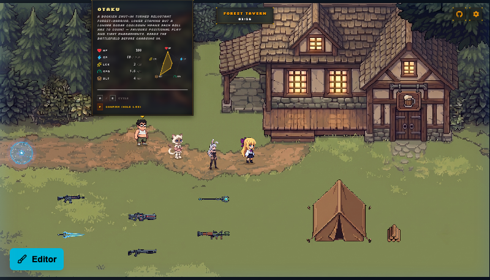

<p align="center">
  
</p>

<h1 align="center">第十一号森林 · The 11th Forest</h1>

<p align="center">
  <b>基于 Phaser 4 + React 19 的 AI 游戏制作探索项目与可视化关卡编辑器</b>
</p>

<p align="center">
  <a href="README.md">English</a> •
  <a href="README-CN.md">简体中文</a>
</p>

---

> [!IMPORTANT]
> **声明**：本项目为 **AI 辅助游戏开发与智能生成管线的探索实验项目 (AI Game Development Research Project)**。旨在验证 AI 驱动的数据驱动架构、像素美术生成与音效管线，**不建议直接部署在商业化生产环境**。

---

## 📖 项目简介 (Overview)

**第十一号森林 (The 11th Forest)** 是一款融合哥特庭院美术风与数据驱动架构的俯视角像素动作射击游戏，灵感灵感来源于 *Brotato (土豆兄弟)*、*Vampire Survivors (吸血鬼幸存者)* 等经典俯视角射击作品。

玩家扮演一名被召唤至不该存在之地的孤独猎人，在被诅咒的森林庭园中穿行与战斗 —— 玫瑰会还击，大树记得你讲过的每一个名字。

除了完整的游戏机制外，项目内置了**强大的可视化网页编辑器**。无需搭建传统的后端 API 服务器，项目直接通过 **Vite 本地开发插件 API (`vite/plugins/editor-api.mjs`)** 提供本地文件读写服务，支持直接在浏览器中绘制空气墙、放置怪物与传送门、裁剪 Sprite 精灵帧并一键持久化写回本地 YAML 数据文件。

---

## 🖼️ 游戏与编辑器截图 (Screenshots)

<p align="center">
  <br/>
  <i>关卡战斗与弹道层级</i>
</p>

<p align="center">
  
  <br/>
  <i>左：酒馆多角色选角与属性雷达 &nbsp;&nbsp;|&nbsp;&nbsp; 右：可视化在线关卡编辑器</i>
</p>

---

## 🤖 AI 服务与生成管线 (AI Services)

本项目深度集成了主流 AI 模型的生成管线，实现了从美术、配音到 BGM 的 AI 驱动开发：

| AI 服务 | 作用领域 | 接入与应用方式 |
| :--- | :--- | :--- |
| **Google Gemini** *(Gemini 3 Pro Image)* | **像素美术图形** | 资产 Prompt 模版位于 `prompts/`，通过 API 自动生成 chroma-key 像素精灵图落盘至 `public/assets/image/` |
| **MiniMax** | **BGM 背景音乐** | 按照氛围 prompt 制作音乐，配乐产物与 `.prompt.json` 保存在 `public/assets/audio/` |
| **ElevenLabs** | **角色配音与战斗音效** | 生成角色受击/闪避独立语音与怪物/武器 SFX，通过 `scripts/elevenlabs-sfx.ts` 自动拉取 |

---

## ✨ 核心特性 (Key Features)

### 🎮 游戏核心玩法 (Gameplay & Systems)
* **灵感参考 (Inspirations)**：借鉴 *Brotato (土豆兄弟)* 的多武器走位射击与数值构建灵感。
* **动态选角与酒馆流转**：包含多名具备独立配音、雷达属性与伤害路由的角色（如 Bunny、Kitty、Wanderer），支持酒馆场景自由选角与武器挑选。
* **物理碰撞与怪物理性 AI**：基于 **Matter.js** 物理刚体碰撞，怪物具备僵直/受击状态机、脚底 BodyBox A* 寻路算法以及波次刷怪 Trigger 机制。
* **无缝传送门 (Teleporters)**：关卡间通过配置化的传送门碰撞点实现平滑数据传递与场景流转。
* **弹道与 Z 轴深度**：支持弹道重力/轨迹、武器 Swing / Orbit 轨迹与动态 Depth 层级管理。

### 🛠️ 内置可视化关卡编辑器 (In-Browser Level Editor)
* 打开 `http://localhost:8080/?editor=1` 即可开启集成在游戏侧边的可视化编辑器。
* **无传统后端依赖**：直接依靠 Vite 本地 Node 插件端点 (`vite/plugins/editor-api.mjs`) 完成磁盘读写。
* **空气墙绘制 (Air Walls)**：Konva 叠加层多边形绘制，支持高墙 (Tall) / 低墙 (Short) 属性。
* **怪物与传送门配置 (Monsters & Teleporters)**：可视化放置怪物理性刷怪点、波次触发条件与传送门跳转目标。
* **Sprite & 素材模块编辑**：提供 Sprite 裁剪预览、材质贴图拼贴与完整属性表单，并持久化保存至 `public/data/` 目录下的 YAML 文件。

### ⚙️ 强校验数据驱动架构 (Data-Driven Architecture)
* 关卡 (`levels/`)、角色 (`characters/`)、怪物 (`monsters/`)、武器 (`weapons/`)、掉落物 (`drops/`)、音效 (`audios/`) 规则 **100% 由 YAML 驱动**。
* 每一个模块均配备严格的 **Zod Schema** 校验，保障游戏数据的高鲁棒性与离线可测试性。

---

## 🛠️ 技术栈 (Tech Stack)

| 架构层 | 技术方案 | 说明 |
| :--- | :--- | :--- |
| **游戏引擎** | [Phaser 4](https://github.com/phaserjs/phaser) + Matter.js | 渲染层、物理引擎、Sprite 动画与场景管理 |
| **应用与 HUD UI** | [React 19](https://react.dev) | 交互式 HUD、酒馆卡牌、设置菜单与关卡编辑器 |
| **本地 API 扩展** | [Vite 6](https://vite.dev) Dev Plugin API | 无需传统后端，本地 Vite 插件直接提供 YAML 文件持久化 API |
| **编程语言** | [TypeScript 5.7](https://www.typescriptlang.org) | 严格类型系统与全栈 Schema 约束 |
| **状态与存档** | [Zustand 5](https://github.com/pmndrs/zustand) | HUD 状态推送到持久化 1Hz 存档写回 |

---

## 🚀 快速开始 (Quick Start)

环境要求：**Node.js 18+**，推荐使用 **pnpm** 包管理器。

```bash
# 1. 安装依赖
pnpm install

# 2. 启动开发服务器 (同时提供游戏与本地 YAML 保存 API)
pnpm dev          # 启动游戏与开发服务器 (http://localhost:8080)
pnpm dev-nolog    # 启动开发服务器 (关闭匿名统计)

# 3. 生产打包
pnpm build        # 构建产物输出至 dist/
```

---

## 📁 项目结构 (Project Structure)

```text
the-11th-forest/
├── public/
│   ├── assets/              # 静态资源 (图片、音效、像素字体)
│   └── data/                # 全量 YAML 游戏配置文件 (关卡/怪物/武器/角色/音效)
├── screenshots/             # 项目展示截图 (战斗、酒馆选角、关卡编辑器)
├── src/
│   ├── components/hud/      # React HUD 渲染组件 (血条、酒馆、选角)
│   ├── editor/              # 可视化网页编辑器 React 组件
│   ├── game/                # Phaser 游戏核心逻辑 (场景、怪物、武器、物理)
│   ├── lib/                 # Schema 校验、数据 Parser、事件总线与通用逻辑
│   └── store/               # Zustand 游戏状态与 1Hz 自动存档
├── vite/plugins/            # 本地 Vite 开发 API 插件 (editor-api 文件写回端点)
└── docs/                    # 完整的技术设计与模块文档
```

---

## 📚 详细文档 (Documentation)

项目拥有极为完善的模块化技术文档，存放在 [`docs/`](./docs) 目录下：

* 📘 [`docs/SCENES.md`](./docs/SCENES.md) — 场景加载流程、传送门关卡流转与酒馆控制。
* 📘 [`docs/EDITOR.md`](./docs/EDITOR.md) — 可视化关卡编辑器功能划分与 Vite 本地持久化 API。
* 📘 [`docs/MODULES.md`](./docs/MODULES.md) — YAML → Schema → Parser → Loader → Logic 统一设计模式。
* 📘 [`docs/SKILL.md`](./docs/SKILL.md) — 关卡数据维护规范、数值平衡计算与 AI 生成管线。
* 📙 模块设计：[`MONSTERS.md`](./docs/MONSTERS.md) · [`WEAPONS.md`](./docs/WEAPONS.md) · [`CHARACTERS.md`](./docs/CHARACTERS.md) · [`DROPS.md`](./docs/DROPS.md) · [`AUDIOS.md`](./docs/AUDIOS.md) · [`PERSIST.md`](./docs/PERSIST.md)

---

## 📄 许可证 (License)

本项目基于 [MIT 许可证](./LICENSE) 开源。

> 原始 Phaser + React + TypeScript 模板版权 © Phaser Studio Inc.，基于 MIT 协议授权。
