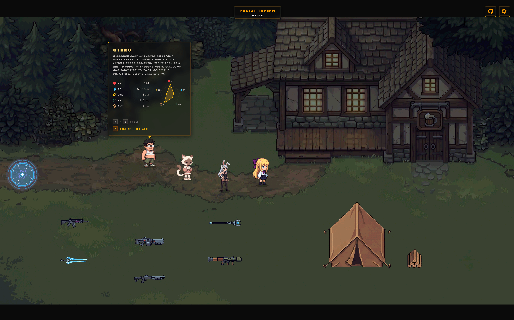
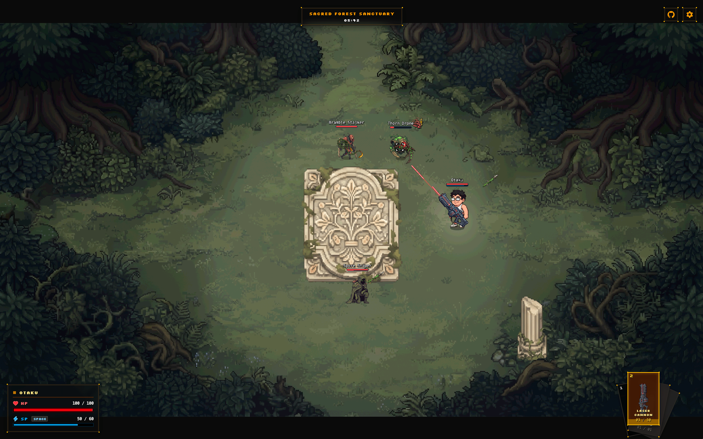
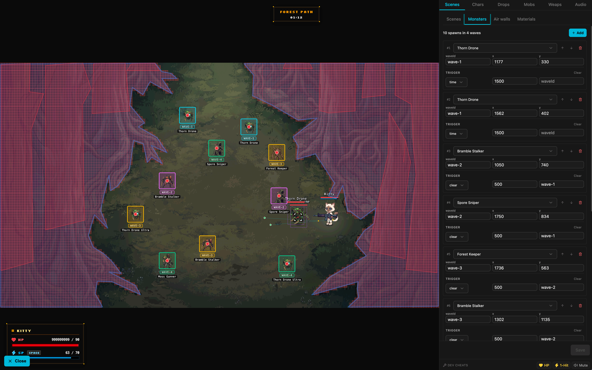

<p align="center">
  
</p>

<h1 align="center">The 11th Forest</h1>

<p align="center">
  <b>A Top-Down Gothic Anime Pixel Shooter & Visual Level Editor exploring AI Game Development Pipelines</b>
</p>

<p align="center">
  <a href="README.md">English</a> •
  <a href="README-CN.md">简体中文</a>
</p>

---

> [!IMPORTANT]
> **Notice**: This repository is an **AI Game Development Research Project & Experimental Prototype**. It explores AI-driven workflows, data-driven engine architecture, and generative asset pipelines. **It is not recommended for direct commercial production deployment.**

---

## 📖 Overview

**The 11th Forest** is a top-down pixel action shooter combining hand-crafted gothic garden aesthetics with a strictly typed data-driven architecture built on Phaser 4 + React 19, inspired by titles like *Brotato* and *Vampire Survivors*.

You play a lone hunter drawn into a forest that shouldn't exist — a place where roses shoot back and the trees remember every name spoken under their shade.

Beyond the core combat systems, the project features an **in-browser visual level editor**. Rather than relying on a traditional backend server, the editor leverages **Vite's local dev plugin API (`vite/plugins/editor-api.mjs`)** to handle local disk read/write directly, allowing developers to draw polygon air walls, place monsters and teleporters, slice sprite sheets, and persist modifications back to local YAML files.

---

## 🖼️ Screenshots

<p align="center">
  <br/>
  <i>Tavern — multi-character selection & radar stats</i>
</p>

<p align="center">
  
  <br/>
  <i>Left: In-game combat and projectile dynamics &nbsp;&nbsp;|&nbsp;&nbsp; Right: In-browser visual level editor</i>
</p>

---

## 🤖 AI Services & Asset Pipeline

The project integrates native AI generation pipelines for graphics, sound, and soundtrack:

| AI Service | Domain | Integration & Usage |
| :--- | :--- | :--- |
| **Google Gemini** *(Gemini 3 Pro Image)* | **Pixel Art & Sprites** | Asset prompt templates stored in `prompts/`. Generates chroma-key sprite sheets directly into `public/assets/image/`. |
| **MiniMax** | **BGM Soundtracks** | Mood-keyed audio generation pipeline. Audio tracks and `.prompt.json` files saved under `public/assets/audio/`. |
| **ElevenLabs** | **Character Voice & SFX** | Generates unique character hurt/dodge voice lines and monster/weapon combat SFX via `scripts/elevenlabs-sfx.ts`. |

---

## ✨ Key Features

### 🎮 Core Gameplay & Systems
* **Inspirations**: Drawing movement, weapon positioning, and stat-building ideas from titles like *Brotato*.
* **Dynamic Character Selection & Tavern Hub**: Multiple characters (Bunny, Kitty, Wanderer) with unique voice acting, radar stats, and damage routing; tavern selection scene and persistent save files.
* **Physics & Monster AI State Machine**: Integrated **Matter.js** rigid body physics, monster knockback/stagger state machine, foot-based BodyBox A* pathfinding, and wave-triggered monster queue.
* **Seamless Teleporter System**: Inter-scene travel via configurable Teleporter trigger zones.
* **Projectile Dynamics & Z-Depth Layering**: Trajectory gravity, weapon swing/orbit paths, and dynamic Z-depth sorting.

### 🛠️ In-Browser Visual Level Editor
* Launch `http://localhost:8080/?editor=1` to toggle the side editor panel.
* **No Traditional Backend Required**: Disk reads/writes are served locally via Vite Node plugin API (`vite/plugins/editor-api.mjs`).
* **Air Wall Canvas**: Polygon drawing overlay powered by Konva, supporting Tall vs. Short collision properties.
* **Monsters & Teleporters**: Visual placement of spawn points, wave trigger conditions, and scene transition teleporters.
* **Sprite & Material Manager**: Tile palette placement, sprite slicing inspector, and direct YAML persistence back to `public/data/`.

### ⚙️ Data-Driven Architecture
* Levels (`levels/`), characters (`characters/`), monsters (`monsters/`), weapons (`weapons/`), drops (`drops/`), and audio rules (`audios/`) are **100% driven by YAML**.
* Every module is validated by strict **Zod Schemas** to ensure offline testability and robust runtime execution.

---

## 📦 Content Layout — one folder per module

Every gameplay module has two siblings under `public/`: a `data/` folder of YAML descriptors (the schema of the thing) and an `assets/` folder of generated media (the skin of the thing). Adding a new monster, weapon, drop, level, character, or audio clip means dropping one YAML + the files it references — no TypeScript touched.

```text
public/
├── data/                     # YAML descriptors (one folder per module)
│   ├── characters/           # one *.yaml per playable character
│   ├── monsters/             # one *.yaml per enemy (stats, body, sprite, anims, prompt)
│   ├── weapons/              # one *.yaml per weapon (damage, cooldown, projectile)
│   ├── drops/                # one *.yaml per drop type (visual + effect)
│   ├── levels/               # index.yaml + one *.yaml per scene (tavern, forest, boss-arena…)
│   └── audios/
│       ├── music/            # one *.yaml per BGM track (webm source, fade, volume)
│       └── sfx/              # one *.yaml per SFX (source, volume, prompt notes)
│
└── assets/                   # Generated media, mirrored by module
    ├── image/
    │   ├── characters/       # chroma-key sprite sheets
    │   ├── monsters/         # per-monster sprite sheets
    │   ├── weapons/          # projectile / muzzle sprites
    │   ├── drops/            # drop icons
    │   ├── materials/        # tilemap tiles
    │   ├── ui/               # HUD icons, panels
    │   └── scenes/           # background art per scene
    ├── audio/
    │   ├── music/            # .webm background tracks
    │   └── sfx/              # .wav / .mp3 one-shots
    ├── font/                 # pixel fonts
    └── lottie/               # lottie JSON animations
```

The data and asset folders share names deliberately: `data/monsters/keeper.yaml` references `assets/image/monsters/keeper.png`. A module's loading, registration, animation driving, and cleanup live in its own `src/game/<module>/` directory — see [`docs/MODULES.md`](./docs/MODULES.md) for the YAML → Schema → Parser → Loader → Logic pattern.

---

## 🛠️ Tech Stack

| Layer | Technology | Description |
| :--- | :--- | :--- |
| **Game Engine** | [Phaser 4](https://github.com/phaserjs/phaser) + Matter.js | Renderer, physics engine, sprite animations & scene management |
| **App & HUD UI** | [React 19](https://react.dev) | Interactive HUD overlays, tavern cards, settings & level editor |
| **Local API** | [Vite 6](https://vite.dev) Dev Plugin API | Replaces traditional backend; provides local YAML save API |
| **Language** | [TypeScript 5.7](https://www.typescriptlang.org) | Strict type system with full-stack schema validation |
| **State & Save** | [Zustand 5](https://github.com/pmndrs/zustand) | HUD state mirror with persisted 1Hz save tick |

---

## 🚀 Quick Start

Requirements: **Node.js 18+**, package manager: **pnpm**.

```bash
# 1. Install dependencies
pnpm install

# 2. Start dev server (serves game and local YAML save API)
pnpm dev          # Launches game dev server (http://localhost:8080)
pnpm dev-nolog    # Launches dev server without ping

# 3. Production build
pnpm build        # Production bundle output to dist/
```

---

## 📁 Project Structure

```text
the-11th-forest/
├── public/
│   ├── assets/              # Static assets (sprites, audio, pixel fonts)
│   └── data/                # YAML game data (levels, monsters, weapons, characters, audios)
├── screenshots/             # Showcase screenshots (combat, tavern, level editor)
├── src/
│   ├── components/hud/      # React HUD overlay components
│   ├── editor/              # In-browser visual level editor React components
│   ├── game/                # Phaser core game logic (scenes, monsters, weapons, physics)
│   └── store/               # Zustand game store & 1Hz autosave
├── vite/plugins/            # Dev API plugin (editor-api endpoints)
└── docs/                    # Architectural design & module documentation
```

---

## 📚 Documentation

Deep-dive documentation lives under [`docs/`](./docs):

* 📘 [`docs/SCENES.md`](./docs/SCENES.md) — Scene loading pipeline, teleporter transitions & tavern hub.
* 📘 [`docs/EDITOR.md`](./docs/EDITOR.md) — Visual level editor sections & Vite local persistence API.
* 📘 [`docs/MODULES.md`](./docs/MODULES.md) — YAML → Schema → Parser → Loader → Logic design pattern.
* 📘 [`docs/SKILL.md`](./docs/SKILL.md) — Data maintenance, balance math & AI asset pipeline.
* 📙 References: [`MONSTERS.md`](./docs/MONSTERS.md) · [`WEAPONS.md`](./docs/WEAPONS.md) · [`CHARACTERS.md`](./docs/CHARACTERS.md) · [`DROPS.md`](./docs/DROPS.md) · [`AUDIOS.md`](./docs/AUDIOS.md) · [`PERSIST.md`](./docs/PERSIST.md)

---

## 📄 License

This project is licensed under the [MIT License](./LICENSE).

> The original Phaser + React + TypeScript template is © Phaser Studio Inc., MIT licensed.
