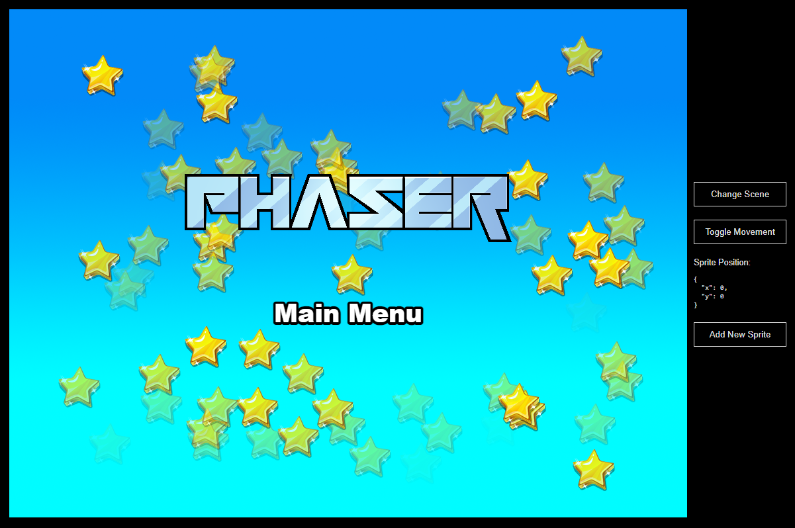

# The 11th Forest · 第十一号森林

A top-down, anime-styled pixel art shooter built on Phaser 4. Fight through cursed gardens of the Eleventh Forest — where every petal hides a bullet and every silence hides a song.



## About

**The 11th Forest** is a top-down shooter with a hand-crafted pixel aesthetic and a moody, gothic-garden setting. You play a lone hunter drawn into a forest that shouldn't exist — a place where roses shoot back and the trees remember every name spoken under their shade.

- **Genre:** Top-down shooter / Roguelite (planned)
- **Art:** Anime-styled pixel art
- **Camera:** Top-down, locked or follow
- **Status:** Pre-production / early prototype

## Tech Stack

| Layer        | Choice                                                       |
|--------------|--------------------------------------------------------------|
| Game engine  | [Phaser 4](https://github.com/phaserjs/phaser)               |
| UI           | [React 19](https://react.dev)                                |
| Build        | [Vite 6](https://vite.dev)                                   |
| Language     | [TypeScript 5.7](https://www.typescriptlang.org)             |
| Music        | [MiniMax](https://MiniMax.io) AI music generation            |

## Getting Started

Requirements: Node.js 18+.

```bash
npm install
npm run dev       # dev server (sends anonymous usage ping)
npm run dev-nolog # dev server without the ping
npm run build     # production build → dist/
```

Dev server defaults to `http://localhost:8080`.

## Project Structure

| Path                          | Description                                                  |
|-------------------------------|--------------------------------------------------------------|
| `index.html`                  | HTML shell                                                   |
| `src/main.tsx`                | React entry point                                            |
| `src/App.tsx`                 | Top-level React component                                    |
| `src/PhaserGame.tsx`          | Phaser ↔ React bridge                                        |
| `src/game/`                   | Game source                                                  |
| `src/game/main.ts`            | Phaser game config & boot                                    |
| `src/game/scenes/`            | Phaser Scenes (MainMenu, Game, …)                            |
| `src/game/EventBus.ts`        | Cross-boundary event bus                                     |
| `public/assets/`              | Static assets (sprites, audio)                               |
| `public/style.css`            | Page-level CSS                                               |

## AI-Generated Music

The soundtrack is produced through the **MiniMax** AI music generation service. Each track is generated against a prompt keyed to an in-game mood (e.g. *“rose garden at dusk, slow piano over low strings”*) and dropped into `public/assets/audio/`.

To regenerate a track, call the MiniMax music API with the prompt stored in the matching `.prompt.json` next to the audio file.

## Writing Code

Edit anything under `src/`. Vite hot-reloads on save.

To add a new Phaser Scene:

1. Create `src/game/scenes/MyScene.ts`.
2. Register it in the `scene` array inside `src/game/main.ts`.
3. Emit `current-scene-ready` from the Scene's `create()` so React can grab a handle:

```ts
class MyScene extends Phaser.Scene {
    constructor () { super('MyScene'); }

    create () {
        // … your game objects

        EventBus.emit('current-scene-ready', this);
    }
}
```

## Documentation

Long-form design, mechanics, art, and tooling docs live in [`docs/`](./docs/), one topic per `UPPERCASE-ENGLISH.md` file. See [`docs/README.md`](./docs/README.md) for the full index.

## License

MIT — see [LICENSE](./LICENSE).

> The original Phaser + React + TypeScript template is © Phaser Studio Inc., MIT licensed.